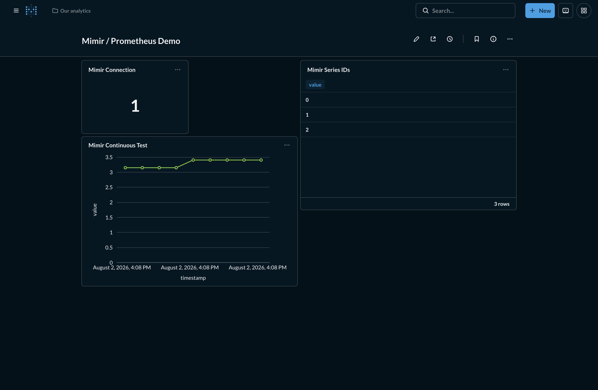

# Metabase Prometheus Driver

A Kotlin-first Metabase community driver for native PromQL queries against
Grafana Mimir and standard Prometheus read APIs. The Metabase extension surface
is implemented by a small Clojure adapter; query, transport, and result logic is
implemented in Kotlin.

The driver is intentionally read-only and native-query-only. It does not
translate visual-query MBQL into PromQL.

## Installation

1. Download the release JAR and its `.sha256` file.
2. Verify the checksum and, for production, the Sigstore bundle and GitHub build
   provenance.
3. Place the JAR in the Metabase plugins directory.
4. Restart Metabase and add a database of type `Mimir / Prometheus`.

Use a base URL such as `https://mimir.example.com/prometheus` or
`http://prometheus:9090`. The driver preserves configured reverse-proxy path
prefixes. Configure a Mimir tenant ID when multitenancy is enabled and select
none, Basic, or Bearer authentication.

## Development

The only host requirements are Git, current Docker with Compose, and
[Atmos](https://atmos.tools). Build and test commands run in pinned containers,
so local and CI execution use the same toolchain.

```bash
atmos project doctor
atmos lint
atmos test unit
atmos test mimir
atmos test prometheus
atmos test metabase
atmos test metabase-synthetic
atmos package
atmos workflow verify -f verify
```

The packaged plugin is written to `build/plugin/prometheus.metabase-driver.jar`.

Start the disposable community-edition demo with:

```bash
atmos demo up
```

This starts a Mimir monolith, Mimir's built-in continuous-test metric producer,
and Metabase OSS with the packaged driver. Metabase is available at
`http://localhost:3000` with `admin@example.test` / `MetabaseLocal123!`; an
idempotent bootstrap creates the Mimir connection and a demonstration dashboard.
No Prometheus server is used by the demo.



```bash
atmos demo logs
atmos demo down
atmos demo reset
```

## Compatibility

The initial compatibility targets are Metabase `v0.60.3.8` and `v0.63.2`,
Grafana Mimir `3.1.4`, and Prometheus `3.13.2`. The exact same packaged JAR is
tested across the full two-by-two Metabase/backend matrix with native
parameters, date ranges, range and instant queries, label discovery, empty
results, and CSV export.

See [Querying](docs/querying.md), [Compatibility](docs/compatibility.md), and
[Architecture](docs/architecture.md) for the stable contracts and support
policy.

## Security

A Metabase community-driver JAR executes inside the Metabase process and must be
treated as trusted application code. This driver does not permit arbitrary
headers or disabled TLS verification and must never log connection secrets or
raw PromQL by default.

Report vulnerabilities using the private process in [SECURITY.md](SECURITY.md).

## License

Apache-2.0.
